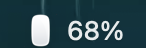
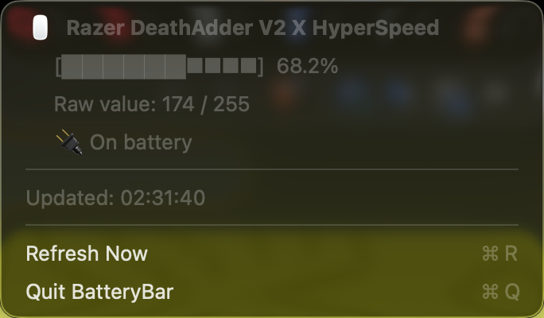

# BatteryBar

A macOS menu bar indicator for the battery level of Razer wireless mice.

macOS reports battery for Bluetooth peripherals, but a Razer mouse on its 2.4GHz
HyperSpeed dongle appears as a plain USB HID device with no battery service — so
the level shows up nowhere in the system. Razer's own Synapse software is not
available on macOS. BatteryBar reads the level directly from the mouse using
Razer's proprietary HID protocol and keeps it in your menu bar.



Clicking it opens a breakdown with the exact percentage, the raw 0–255 value the
mouse reports, and charging state.



<sub>Screenshots show sample data.</sub>

## Supported hardware

The protocol is queried over the dongle's **Mouse** HID interface
(UsagePage `0x01`, Usage `0x02`), vendor ID `0x1532`.

**Developed and tested against:**

| Device | PID | Connection |
| --- | --- | --- |
| Razer DeathAdder V2 X HyperSpeed | `0x009C` | 2.4GHz HyperSpeed dongle |

**Also recognised** — these use the same power command class and are expected to
work, but are untested. Reports welcome:

| Device | PID | | Device | PID |
| --- | --- | --- | --- | --- |
| DeathAdder V3 HyperSpeed | `0x00B6` | | Naga Pro | `0x0088` |
| DeathAdder V2 Pro | `0x007C` | | Orochi V2 | `0x008F` |
| Viper V2 Pro | `0x00A5` | | Basilisk V3 X HyperSpeed | `0x00AA` |
| Viper V3 HyperSpeed | `0x009A` | | Basilisk X HyperSpeed | `0x008A` |
| Viper Ultimate | `0x0090` | | Basilisk Ultimate | `0x0083` |
| Atheris | `0x0078` | | | |

Adding a model is a one-line change — drop its PID into `RAZER_WIRELESS_PIDS` in
`src/wireless_battery_monitor.c`. Find yours with:

```sh
ioreg -c IOHIDDevice -r -l | grep -A5 -i razer
```

Requires macOS 11 (Big Sur) or later. The release binary is universal — Apple
Silicon and Intel.

## Install

### From a release

Download `BatteryBar-<version>-universal.zip` from the
[Releases](https://github.com/wryonik/BatteryBar/releases) page, unzip it, and
drag `BatteryBar.app` to `/Applications`.

The build is ad-hoc signed but not notarized, so Gatekeeper will refuse it on
first launch. Either right-click the app and choose **Open**, or clear the
quarantine flag:

```sh
xattr -dr com.apple.quarantine /Applications/BatteryBar.app
```

### From source

Only the Xcode command line tools are needed — no Xcode, no package manager:

```sh
xcode-select --install     # if you don't already have clang and swiftc
git clone https://github.com/wryonik/BatteryBar.git
cd BatteryBar
make
```

That produces `build/BatteryBar.app` containing both universal binaries. Then:

```sh
make run        # build and launch it
make install    # copy the bundle into /Applications
make dist       # package the release zip + sha256 into dist/
make clean      # remove build/ and dist/
make uninstall  # quit it and remove it from /Applications
```

To start it automatically, add `/Applications/BatteryBar.app` under **System
Settings → General → Login Items**.

## Command line

The helper that does the actual reading is usable on its own:

```sh
$ ./build/wireless_battery_monitor
Razer DeathAdder V2 X HyperSpeed         Battery:  68.2% [Discharging]  (raw: 174/255)

$ ./build/wireless_battery_monitor --json
$ ./build/wireless_battery_monitor --watch --interval 30
```

It exits `0` when at least one supported device was read, `1` otherwise, which
makes it easy to drop into a status bar script or a cron job.

## How it works

Two pieces, deliberately kept separate:

**`src/wireless_battery_monitor.c`** — talks to the mouse. It enumerates HID
devices through IOKit, picks out the Razer mouse interface, and sends a 90-byte
feature report carrying the power command class (`0x07`) with the "get battery"
command (`0x80`), XOR-checksummed over bytes 2–87 the way Razer's firmware
expects. After a 300ms wait for the wireless round trip it reads the response
back; byte 9 holds the level as 0–255, which is scaled to a percentage. Charging
state comes from the same exchange with command `0x84`, which not every model
answers. Output is plain text or JSON.

**`src/BatteryBar.swift`** — the menu bar app. It polls the helper every 60
seconds, decodes the JSON, and renders the status item and its dropdown. It
holds no device knowledge at all, so supporting a new mouse never touches this
file.

The split means the protocol work is reusable and independently debuggable —
when something breaks, running the helper directly tells you whether the problem
is the mouse or the UI.

At runtime the app finds the helper next to its own executable, falling back to
its `Resources` directory, then `/usr/local/bin` and `/opt/homebrew/bin`. Set
`BATTERYBAR_BACKEND` to an explicit path to override that.

## Troubleshooting

**"No supported mouse detected"** — the dongle isn't plugged in, the mouse is
powered off, or its PID isn't in the table. Check with the `ioreg` command above.

**"Could not read battery"** with a `SetReport failed` or `GetReport failed`
error — another process is holding the device open. Quitting other peripheral
software (OpenRazer-style tools, remapping utilities) generally clears it.

**Nothing appears in the menu bar** — a menu bar with many items can push it off
screen on a notched display; try quitting another status item to confirm. The
app is `LSUIElement`, so it deliberately shows no Dock icon.

**The percentage looks coarse** — that's the hardware. The mouse reports one
byte, and most models move in visible steps rather than continuously.

## License

MIT — see [LICENSE](LICENSE).
